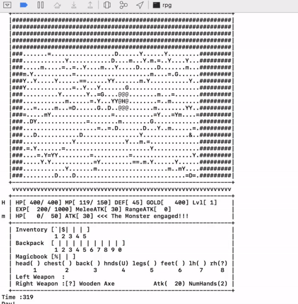

# Text Based RPG

A simple text based RPG 

  

Features
--------

- Five unique classes including **Knight**, **Paladin**, **Warrior**, **Hunter**, and **Archer**
- Mini-bosses with player tracking AI.
- **Inventory** and **backpacks** for storing items.
- **Random world layout** for a unique experience every play through.
- **Spells**, **potions**, and **explodables** that can be bought from **merchants**.

	
Legend
------

### Units
H: Hero   
m: Monster    
&: Boss  
G: Merchant   
V: Dragon Head   
r: Dragon Body   

### World Generation
Y: Tree  
#: Out of Bounds   
D: Chest  
=: Mount   

### Armour

A: Helmet   
W: Chest-plate   
L: Pants   
Q: Cape   
U: Gloves    
F: Boots   

### Weapons

C: Bow   
!: Bat   
?: Axe   

### Consumables
%: Spell   
$: Magic Scroll   
I: Torch   
b: Potion   
*: Bomb   
_: Time Bomb  
`: Key   

Staff
-----

Programmer : Joon Kang

Mentor : Samil Chai
 
 
Work Period
-----------

Start Date: 2015-07-20 

End Date: 2016-01-30

